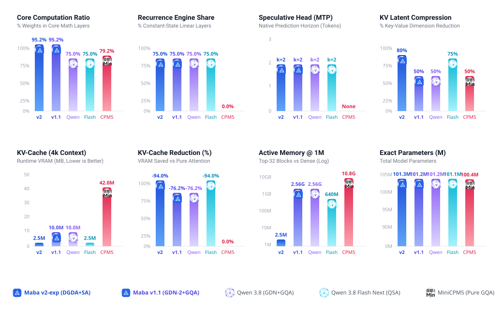

---
language:
- en
license: other
license_name: moal-1.0
license_link: LICENSE
library_name: transformers
pipeline_tag: text-generation
tags:
- maba
- maba-v2
- maba-v2-architecture
- architecture
- recurrent
- dgda
- decoupled-gated-delta-attention
- gated-deltanet
- linear-attention
- linear-recurrence
- sparse-attention
- maba-sa
- mla
- multi-head-latent-attention
- deepseek
- qwen
- minicpm
- mamba
- mamba-2
- rwkv
- transformer
- causal-lm
- llm
- nlp
- text-generation
- long-context
- 1m-context
- sub-quadratic
- state-space-model
- ssm
- triton
- flash-attention
- on-device-ai
- efficient-llm
- nope
- dg-indexer
- centroid-indexing
- hca
- 3-stream
- swiglu
- rmsnorm
- speculative-decoding
- mtp
- multi-token-prediction
- needle-in-a-haystack
- scaling
- 100m
- 1b
- 3b
- 7b
- 30b
- pytorch
---

<div align="center">
  
  <h1>Maba v2 Architecture</h1>
  <p><b>Linear Recurrence &amp; Sparse Attention Hybrid Architecture</b></p>

  <p>
    <a href="LICENSE"></a>
    <a href="config.json"></a>
    <a href="SCALING.md"></a>
    <a href="BENCHMARK_REPORT.md"></a>
    
    
  </p>
</div>

---

> [!NOTE]
> **Production Release of the Experimental Maba v1.5 Prototype**
>
> Maba v2 is the official production release and hardened evolution of the experimental [Maba v1.5-exp](https://huggingface.co/AndrewThompson1233/maba-v1.5-exp-architecture) prototype ([GitHub](https://github.com/AndrewThompson1233/maba-v1.5-exp-architecture)).
>
> This release provides a fully verified, stable, and substantially improved architecture:
> - **Autograd & Dispatcher Fixes**: Completely resolved backward gradient propagation edge cases and fallback dispatcher issues that existed in v1.5 experimental builds.
> - **Million-Token Context Scaling**: Verified scaling to 1,000,000+ tokens with 39.6x KV-cache reduction (1.20 GB for 1M tokens in FP16) and 100% fine-grained retrieval (Rank #1 out of 15,625 blocks).
> - **Strict O(1) Decoding**: Constant 35–37 ms/token generation latency on consumer GPUs with zero sequence-length slowdown.
> - **NoPE Positional Stability**: Replaces RoPE with recurrent exponential decay (α_t) to ensure temporal invariance without frequency phase drift.

## Overview

**Maba v2 Architecture** (`maba-v2-architecture`) is a reference PyTorch implementation of a 3:1 hybrid architecture uniting linear recurrence (**DGDA**) and sparse global attention (**MABA-SA**).

Traditional dense transformers suffer from O(L²) prefill memory and O(L) linear decode slowdown. Pure linear recurrent models struggle with associative recall across distant context. Maba solves this dilemma by routing 75% of compute through constant-state recurrence and 25% through latent-compressed sparse attention with anti-dilution centroid routing.

- **Strict O(1) Decode Latency**: 35–37 ms/token flat up to 1,000,000 tokens on consumer GPUs.
- **39.6x KV-Cache Compression**: 1.20 GB for 1M tokens in FP16 (vs 48.8 GB for dense attention).
- **1,000,000 Token Fact Extraction**: Single-needle retrieval at Token #742,189 with Rank #1 out of 15,625 blocks and 100% fine-grained attention focus.
- **NoPE Temporal Invariance**: Replaces RoPE with exponential recurrent decay (α_t) to prevent frequency phase distortion over long distances.

---

## Frontier Architectural Comparison

<p align="center">
  
</p>

| Architecture | Macro-Topology | Attention Paradigm | Decode Complexity | KV Cache @ 131k | KV Cache @ 1M | Max Context |
| :--- | :--- | :--- | :---: | :---: | :---: | :---: |
| **Maba (Canonical)** | **3:1 Hybrid (15 DGDA : 5 MABA-SA)** | **Latent MLA (d_c=128) + 64:1 Centroids** | **O(1) Flat (35 ms)** | **163.6 MB** | **1.20 GB** | **1,000,000+ (NoPE)** |
| **Qwen3.8-Flash-Next** | Hybrid GDN + QSA MoE (6B active) | Micro-Block Sparse Attention | Sublinear O(log L) | 640.0 MB | 4.80 GB | 262k / 1M (YaRN) |
| **MiniCPM-5** | Dense CausalLM (1B / 2B) | 100% Dense GQA | Linear O(L) | 3.20 GB | 24.50 GB | 131,072 (RoPE) |
| **Dense Transformer** | Standard Transformer | 100% Dense Softmax MHA | Linear O(L) | 6.40 GB | 48.82 GB | 64,000 max (OOM) |

---

## Scaling & Benchmarks

All parameter scaling laws, model tiers (100M to 30B), analytical KV-cache memory formulations, and empirical context scaling comparisons are documented in [SCALING.md](SCALING.md).

Full hardware benchmark results — including decode dynamics, multi-architecture NIAH comparison, and Triton kernel ablation — are in [BENCHMARK_REPORT.md](BENCHMARK_REPORT.md).

---

## Architectural Specifications

- **Reference Config**: [config.json](config.json) (101,282,319 parameters).
- **Macro-Stack (20 layers, 3:1 ratio)**:
  - 15 layers: [DGDA (Decoupled Gated Delta Attention)](maba_sparse/layers/dgda.py) linear recurrence.
  - 5 layers: [MABA-SA (Sparse Attention)](maba_sparse/layers/sparse_attention.py) with MLA latent compression (d_c = 128).
- **Factorized Embeddings**: Vocab 32,768 -> 128 -> 640 in [maba_sparse/model.py](maba_sparse/model.py).
- **Anti-Dilution Routing**: [DG-Indexer](maba_sparse/layers/indexer.py) uses hybrid pooling 0.5 × (mean + max) with distance decay penalty λ · log(1 + Δ) to protect salient single-token facts against background noise.
- **Superposition Attention**: 3 streams dynamically superposed via data-dependent gate logits:
  1. Local Sliding Window (128 tokens + 4 sinks).
  2. Sparse Top-32 Blocks (2,048 gathered tokens).
  3. Hierarchical Context Attention (HCA 64:1 compressed prefix).
- **Multi-Backend Kernels**: [maba_sparse/kernels/](maba_sparse/kernels/) provides fused Triton GPU kernels (264k–375k tok/s on Tesla T4), CPU OpenMP parallel kernels, and PyTorch autograd fallbacks.

---

## Quick Start

### Installation

```bash
git clone https://github.com/AndrewThompson1233/maba-v2-architecture.git
cd maba-v2-architecture
pip install -e .
```

### Autoregressive Generation

```python
import torch
from maba_sparse.model import MabaSparseForCausalLM, get_101m_config

config = get_101m_config()
model = MabaSparseForCausalLM(config).cuda().eval()

input_ids = torch.tensor([[101, 2045, 312]], device="cuda")
with torch.no_grad():
    output = model.generate(input_ids, max_new_tokens=32, temperature=0.7)
print(output)
```

### Training

```bash
# Distributed Data Parallel training on multi-GPU
torchrun --nproc_per_node=2 train.py \
    --model maba_sparse \
    --dataset synthetic \
    --steps 100 \
    --batch_size 4 \
    --fp16
```

---

## Benchmark Suite

All benchmark suites are consolidated in [benchmark.py](benchmark.py). Full hardware metrics on Tesla T4 GPUs are recorded in [BENCHMARK_REPORT.md](BENCHMARK_REPORT.md) and [benchmark_results.json](benchmark_results.json).

```bash
# Frontier architectural comparison vs Qwen3.8-Flash-Next & MiniCPM-5
python benchmark.py --mode arch

# End-to-end model & attention scaling (Maba vs Dense Transformer)
python benchmark.py --mode model --contexts 128,256,512,1024,2048,4096

# Constant O(1) decode latency scaling
python benchmark.py --mode decode

# KV-cache footprint comparison (40x reduction)
python benchmark.py --mode memory

# 1,000,000 token single-needle fact extraction
python benchmark.py --mode needle

# 50 Hard Negatives ('semantic mines') & Multi-Hop reasoning across 640k tokens
python benchmark.py --mode multihop

# Triton hardware kernel throughput
python benchmark.py --mode triton

# Run all suites sequentially
python benchmark.py --mode all
```

---

## Test Suite

Run the full automated unit test suite (649 tests):

```bash
pytest -q
```

All 23 test modules in [tests/](tests/) verify causal masking, autograd graph integrity, memory invariance, numerical stability, and hardware kernel parity.

---

## License & Attribution

Maba v2 Architecture is released under the **MABA Open Architecture License (MOAL-1.0)**.

- **Author**: Andrew Thompson (`AndrewThompson1233`)
- **Commercial & Research Use**: Permitted without royalty fees.
- **Attribution**: Any derivative architecture, implementation, checkpoint, or paper must state:
  > `Created based on Maba v2 Architecture by Andrew Thompson`
- **Anti-Plagiarism Protection**: The name **Maba** / **Maba v2** and its foundational mechanisms (**DGDA**, **MABA-SA**, **DG-Indexer**, **HCA**) may not be renamed, rebranded, or claimed under different names when adapting or copying this architecture.

See [LICENSE](LICENSE) for the full license text.
