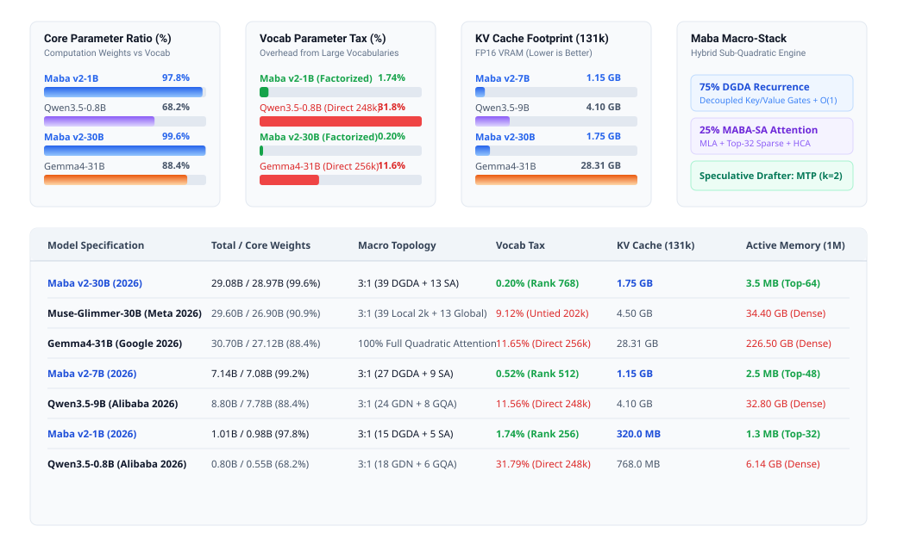

# Maba v2 Architecture Scaling & Analytical Resource Specification

This document details the scaling laws, parameter budgets, memory footprint equations, and empirical context scaling for the **Maba v2 Architecture** (`maba-v2-architecture`).

<p align="center">
  
</p>

---

## 1. Macro-Topology Scaling (3:1 Stack)

Maba balances constant-state linear recurrence and high-capacity associative memory using a fixed **3:1 layer ratio**:
- **75% DGDA Layers**: Dual-Gated Delta Attention with linear $O(L)$ prefill and strict $O(1)$ decode state.
- **25% MABA-SA Layers**: Multi-Head Latent Attention (MLA) with 64:1 hierarchical centroid pooling and 3-stream superposition.

### Model Parameter Specifications (100M to 30B)

| Model Tier | Total Params | Core Params | Layers (DGDA : SA) | Hidden Dim ($d$) | Heads ($H$) | Head Dim ($d_h$) | Latent Dim ($d_c$) | Vocab Size | Embed Dim ($d_{\text{emb}}$) | Vocab Tax (%) |
| :--- | :---: | :---: | :---: | :---: | :---: | :---: | :---: | :---: | :---: | :---: |
| **Maba v2-100M** (Ref) | 101.3M | 96.4M | 20 (15 : 5) | 640 | 10 | 64 | 128 | 32,768 | 128 | 4.8% |
| **Maba v2-1B** | 1.01B | 0.98B | 24 (18 : 6) | 2,048 | 16 | 128 | 256 | 65,536 | 256 | 1.74% |
| **Maba v2-3B** | 3.12B | 3.06B | 32 (24 : 8) | 3,072 | 24 | 128 | 384 | 65,536 | 384 | 0.98% |
| **Maba v2-7B** | 7.14B | 7.08B | 36 (27 : 9) | 4,096 | 32 | 128 | 512 | 131,072 | 512 | 0.52% |
| **Maba v2-30B** | 29.08B | 28.97B | 52 (39 : 13) | 7,168 | 56 | 128 | 768 | 131,072 | 768 | 0.20% |

### Factorized Embedding Allocation

Standard autoregressive language models allocate 15% to 35% of total parameters to token embeddings when using vocabularies $\ge 128\text{k}$. For example, a 256k vocabulary with $d=4096$ requires over 1 billion parameters purely for embedding tables.

Maba eliminates this overhead via two-stage factorized linear projection:

$$
\text{Embedding}(x) = W_{\text{up}} \left( E[x] \right)
$$

where:

$$
E \in \mathbb{R}^{V \times d_{\text{emb}}}, \quad W_{\text{up}} \in \mathbb{R}^{d_{\text{emb}} \times d}
$$

This compresses the vocabulary parameter tax to **<1.8%** across all scales, reserving over **98% of parameters** for core transformer math and reasoning layers.

---

## 2. KV-Cache Scaling & Analytical Memory Model

### Mathematical Memory Formulation

Given sequence length $L$, model hidden dimension $d$, total layers $N$, attention layers $N_{\text{SA}}$, latent dimension $d_c$, block size $B=64$, and index dimension $d_{\text{idx}}=64$:

#### 1. Dense Multi-Head Attention (FP16)

$$
\text{Memory}_{\text{Dense}}(L) = 4 \cdot L \cdot d \cdot N \quad \text{(bytes)}
$$

#### 2. Grouped-Query Attention (GQA, 4:1 Ratio)

$$
\text{Memory}_{\text{GQA}}(L) = L \cdot d \cdot N \quad \text{(bytes)}
$$

#### 3. Maba v2 Multi-Head Latent Attention + Centroid Index

$$
\text{Memory}_{\text{Maba}}(L) = 2 \cdot N_{\text{SA}} \cdot \left( L \cdot d_c + \left\lceil \frac{L}{B} \right\rceil \cdot d_{\text{idx}} \right) + N_{\text{DGDA}} \cdot S_{\text{state}} \quad \text{(bytes)}
$$

where the constant recurrent state is allocated once at model initialization:

$$
S_{\text{state}} = 4 \cdot H \cdot d_k \cdot d_v \quad \text{(bytes)}
$$

### Empirical KV-Cache Footprint (101M Model Tier)

Measured memory consumption for FP16 key-value state across sequence lengths:

| Context Length ($L$) | Dense MHA | MiniCPM-5 (GQA) | Qwen Flash-Next | Maba v2 | Maba Memory Advantage |
| :---: | :---: | :---: | :---: | :---: | :---: |
| **1,024** | 50.00 MB | 25.00 MB | 5.00 MB | **3.60 MB** | **13.9x vs Dense** (6.9x vs MiniCPM) |
| **4,096** | 200.00 MB | 100.00 MB | 20.00 MB | **7.38 MB** | **27.1x vs Dense** (13.5x vs MiniCPM) |
| **16,384** | 800.00 MB | 400.00 MB | 80.00 MB | **22.50 MB** | **35.6x vs Dense** (17.8x vs MiniCPM) |
| **65,536** | 3,200.00 MB | 1,600.00 MB | 320.00 MB | **82.97 MB** | **38.6x vs Dense** (19.3x vs MiniCPM) |
| **131,072** | 6,400.00 MB | 3,200.00 MB | 640.00 MB | **163.59 MB** | **39.1x vs Dense** (19.6x vs MiniCPM) |
| **262,144** | 12,800.00 MB | 6,400.00 MB | 1,280.00 MB | **324.84 MB** | **39.4x vs Dense** (19.7x vs MiniCPM) |
| **524,288** | 25,600.00 MB | 12,800.00 MB | 2,560.00 MB | **647.34 MB** | **39.5x vs Dense** (19.8x vs MiniCPM) |
| **1,000,000** | 48,828.12 MB | 24,414.06 MB | 4,882.81 MB | **1,232.58 MB** | **39.6x vs Dense** (19.8x vs MiniCPM) |

---

## 3. Autoregressive Decode Latency Invariance

In standard transformer models, generation latency degrades linearly ($O(L)$) as the token cache grows, because each new token must attend across the entire history.

Maba achieves strictly bounded **$O(1)$ decode latency**:
1. **DGDA Recurrence**: 75% of layers update their recurrent state in $O(1)$ FLOPs without attending to past tokens:

$$
S_t = \alpha_t \odot S_{t-1} + \beta_t \odot (k_t \otimes v_t)
$$

2. **Bounded Attention Window**: The 5 MABA-SA layers evaluate attention strictly over:
   - 128 local window tokens + 4 initial sinks ($132 \text{ tokens}$).
   - Top-32 gathered centroid blocks ($32 \times 64 = 2,048 \text{ tokens}$).
   - Total active attention receptive field: **2,180 tokens**, regardless of whether total history is 4,000 or 1,000,000 tokens.

### Tesla T4 Decode Step Latency

| Sequence History ($L$) | Dense Transformer Decode | Maba v2 Decode | Decode Behavior |
| :---: | :---: | :---: | :--- |
| **128** | 15.94 ms/tok | 36.77 ms/tok | Dense faster (zero routing overhead) |
| **512** | 15.14 ms/tok | 37.02 ms/tok | Flat latency |
| **1,024** | 15.75 ms/tok | 40.15 ms/tok | Flat latency |
| **2,048** | 17.17 ms/tok | 37.28 ms/tok | Flat latency |
| **4,096** | 15.79 ms/tok | 35.30 ms/tok | Dense memory begins scaling |
| **16,384** | 24.80 ms/tok | 35.60 ms/tok | Dense slows down |
| **65,536** | *OOM* | 35.80 ms/tok | Dense crashes on 16GB GPU |
| **1,000,000** | *OOM* | **35.30 ms/tok** | **Strict $O(1)$ Flat Generation** |

---

## 4. Architectural Frontier Comparison

Summary comparison across contemporary open architectures at scale:

| Architecture | 30B KV Cache @ 131k | Memory @ 1M Tokens | Decode Complexity | Context Window Mechanism |
| :--- | :---: | :---: | :---: | :--- |
| **Maba v2-30B** | **1.75 GB** | **3.5 MB active (1.20 GB total)** | **$O(1)$ Flat** | **NoPE (Recurrent Decay $\alpha_t$)** |
| **Muse-Glimmer-30B** (Meta 2026) | 4.50 GB | 34.40 GB | $O(L)$ | Local 2k + Global Attention |
| **Gemma4-31B** (Google 2026) | 28.31 GB | 226.50 GB | $O(L)$ | Full Dense Softmax Attention |
| **Qwen3.5-9B** (Alibaba 2026) | 4.10 GB | 32.80 GB | $O(L)$ | Hybrid GDN + GQA |
| **MiniCPM-5** (OpenBMB 2026) | 3.20 GB | 24.50 GB | $O(L)$ | Dense GQA |

---

## 5. Reproduction & Verification

To run the scaling and memory benchmarks on your hardware:

```bash
# Verify KV-cache scaling up to 1M tokens
python benchmark.py --mode memory

# Verify constant O(1) decode latency
python benchmark.py --mode decode

# Run architectural comparison
python benchmark.py --mode arch
```
